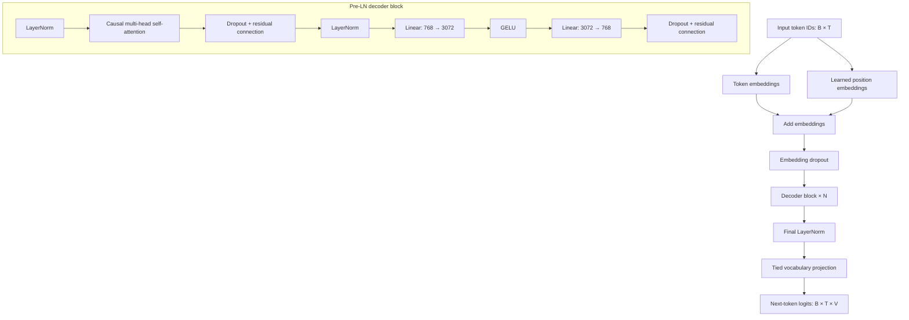
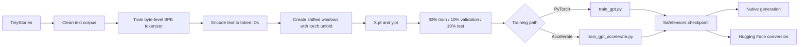
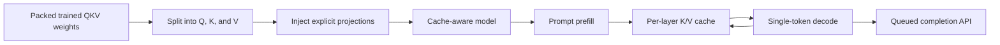

# Decoder-Only Transformer

A 32M-parameter decoder-only Transformer built and trained from scratch with PyTorch on TinyStories. This repository follows the complete language-model lifecycle: tokenizer training, memory-efficient dataset preparation, causal language-model pretraining, safetensors checkpointing, Hugging Face conversion, text generation, and experimental KV-cached serving.

> **Learning-purpose project:** This codebase was created for education and experimentation. It is not designed or tested for production use.

- **Hugging Face model:** [shubhamprakash108/decoder-only-transformer-tinystories-32m](https://huggingface.co/shubhamprakash108/decoder-only-transformer-tinystories-32m)
- **Google Colab demo:** [Open the interactive notebook](https://colab.research.google.com/drive/1T-8ix32kmsE9qlmjEiGjBrrJvmOSDMIF?usp=sharing)
- **Training hardware:** NVIDIA RTX A6000 on RunPod

## Project highlights

- Decoder-only Transformer implemented directly with PyTorch
- Custom byte-level BPE tokenizer with a 32,000-token vocabulary
- TinyStories preprocessing and next-token training-data generation
- Memory-efficient sliding windows using `torch.unfold`
- Standard PyTorch and Hugging Face Accelerate training paths
- Pre-layer normalization, causal self-attention, GELU MLPs, and residual connections
- Tied input embeddings and output projection
- Safetensors-compatible checkpoint saving and loading
- Temperature, top-k sampling, repetition penalty, and EOS stopping
- Hugging Face-compatible custom model with `trust_remote_code=True`
- Experimental QKV conversion, KV caching, request queuing, and FastAPI serving

## Published model

| Property | Value |
| --- | --- |
| Model | Decoder-Only Transformer TinyStories 32M |
| Parameters | 32,451,840 |
| Training data | TinyStories |
| Training subset | 100,000 stories |
| Hidden size | 768 |
| Transformer blocks | 1 |
| Attention heads | 8 |
| Head dimension | 96 |
| Feed-forward size | 3,072 |
| Vocabulary size | 32,000 |
| Training sequence length | 128 tokens |
| Maximum sequence length | 1,024 tokens |
| Positional representation | Learned position embeddings |
| Activation | GELU |
| Dropout | 0.2 |
| Embedding/output weights | Tied |
| Training hardware | NVIDIA RTX A6000 |
| Training platform | RunPod |

The model is trained for causal next-token prediction on TinyStories. Its output is expected to resemble short, simple story text; it is not a general-purpose assistant or instruction-following model.

## Run the Hugging Face model

```python
import torch
from transformers import AutoModelForCausalLM, AutoTokenizer

# Load tokenizer and model
tokenizer = AutoTokenizer.from_pretrained(
    "shubhamprakash108/decoder-only-transformer-tinystories-32m",
    trust_remote_code=True,
)
model = AutoModelForCausalLM.from_pretrained(
    "shubhamprakash108/decoder-only-transformer-tinystories-32m",
    trust_remote_code=True,
)

# Set up device
device = "cuda" if torch.cuda.is_available() else "cpu"
model.to(device)
model.eval()

# Generate text
prompt = "The transformer is based on"
inputs = tokenizer(prompt, return_tensors="pt").to(device)

output_ids = model.generate(
    **inputs,
    max_new_tokens=50,
    do_sample=True,
    temperature=0.8,
    pad_token_id=tokenizer.eos_token_id,
)

print(tokenizer.decode(output_ids[0], skip_special_tokens=True))
```

The model repository contains custom modeling code, which is why both loader calls use `trust_remote_code=True`.

## Architecture

### Model data flow



Each token can attend only to itself and earlier tokens. The upper-triangular causal mask prevents information from future positions from leaking into a prediction.

### Training pipeline



For every input window, the target is shifted by one token:

```text
Input:  [token_0, token_1, token_2, ..., token_n-1]
Target: [token_1, token_2, token_3, ..., token_n]
```

The loss is token-level cross-entropy over the 32,000-token vocabulary.

### KV-cached inference experiment

The original training model uses `nn.MultiheadAttention`, which stores Q, K, and V in packed projection tensors. The experimental inference path splits those learned tensors into explicit query, key, and value projections without retraining the model.



Prefill processes the prompt once. Each later decoding step processes only the newest token while reusing the cached keys and values from earlier positions.

### API load-test results

Tested on an AMD Ryzen 5 4500U CPU.

```text

API Load Test: KV Caching Speedup

Note: Since batching is not built yet (Stage 4), requests are sent sequentially.

[1/2] Sending 4 requests with UNIQUE prompts (Normal / Cache Miss)...
      Request 1 took 3.064s
      Request 2 took 2.522s
      Request 3 took 2.521s
      Request 4 took 2.709s

[2/2] Sending 4 requests with IDENTICAL prompts (KV Cache Hit)...
      (Pre-filling cache for shared prompt...)
      Request 1 took 2.268s
      Request 2 took 2.443s
      Request 3 took 2.255s
      Request 4 took 2.277s

  RESULTS:
  Avg latency NORMAL (Cold Start):   2.704s
  Avg latency KV CACHE (Warm Start): 2.310s


```

## Repository structure

```text
.
├── config/
│   └── config.yml                         # Model, tokenizer, data, and inference settings
├── corpus/
│   ├── download_data/                     # TinyStories and other download scripts
│   └── data/pretraining_data/
│       └── prepare_dataset.py             # Token encoding and sliding windows
├── model/gpt/
│   ├── model/
│   │   ├── gpt2_model.py                  # Native decoder-only Transformer
│   │   └── dataloader.py                  # Train/validation/test loaders
│   ├── tokenizer/
│   │   └── hf_tokenizer_training.py       # Byte-level BPE tokenizer
│   ├── train_gpt.py                       # Standard PyTorch training
│   ├── train_gpt_accelerate.py            # Accelerate training
│   ├── generate.py                        # Native text-generation CLI
│   └── custom_inferece_server/
│       └── stages/                         # QKV, KV-cache, API, and queue experiments
├── converted_model/                       # Hugging Face-compatible custom model
├── utils/                                 # Shared configuration utilities
├── hf_inference.py                        # Published-model inference example
├── OBSERVATIONS.md                        # Experiment results and lessons learned
├── run.sh                                 # Standard end-to-end pipeline
├── run_accelerate.sh                      # Accelerate pipeline
└── run_both.sh                            # Training-time comparison
```

## Important implementation details

### Weight tying and safetensors

The token embedding and final vocabulary projection deliberately share one parameter:

```python
self.final_linear_layer.weight = self.token_embedding.weight
```

Safetensors does not serialize two state-dict keys that point to the same memory without an explicit strategy. The native checkpoint path stores one copy and restores the tie after loading. The Hugging Face conversion path makes the weights independently serializable and re-establishes the tie through the custom model class.

### Memory-efficient dataset preparation

Building every sliding window as a Python list caused excessive memory usage on a large corpus. The current implementation uses tensor views:

```python
X_tensor = tokens_tensor[:-1].unfold(0, block_size, 1)
y_tensor = tokens_tensor[1:].unfold(0, block_size, 1)
```

Because unfolded tensors may be non-contiguous, training uses `reshape` rather than `view` when flattening logits and targets.

### Model selection and generation

The training code tracks validation loss and includes gradient clipping, cosine learning-rate decay, checkpoint saving, and early stopping. The native generator supports temperature, top-k sampling, a repetition penalty, and early termination on the end-of-text token.

## Limitations

- Trained on TinyStories rather than a broad, general-purpose corpus
- One Transformer block limits representational depth
- Outputs may be repetitive, inconsistent, or factually incorrect
- Not instruction-tuned and not intended as a conversational assistant
- Maximum context is limited to 1,024 tokens
- Experimental inference cache is in memory and does not implement production-grade eviction
- Request queuing is not continuous or dynamic batching
- No production guarantees for reliability, security, scalability, or model safety

## Experiment notes

[OBSERVATIONS.md](OBSERVATIONS.md) records the training runs, loss behavior, overfitting diagnosis, dataset OOM fix, tied-weight serialization issue, QKV conversion, and KV-cache implementation lessons.
